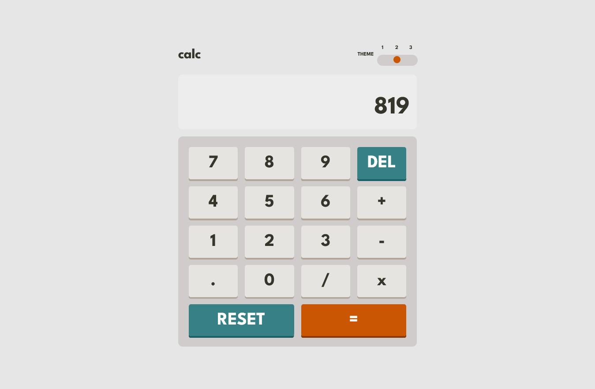

# Frontend Mentor - Calculator app solution

This is a solution to the [Calculator app challenge on Frontend Mentor](https://www.frontendmentor.io/challenges/calculator-app-9lteq5N29). Frontend Mentor challenges help you improve your coding skills by building realistic projects. 

## Table of contents

- [Overview](#overview)
  - [The challenge](#the-challenge)
  - [Screenshot](#screenshot)
  - [Links](#links)
- [My process](#my-process)
  - [Built with](#built-with)
  - [What I learned](#what-i-learned)
  - [Continued development](#continued-development)
  - [Useful resources](#useful-resources)
- [Author](#author)
- [Acknowledgments](#acknowledgments)
## Overview
### The challenge

Users should be able to:

- See the size of the elements adjust based on their device's screen size
- Perform mathmatical operations like addition, subtraction, multiplication, and division
- Adjust the color theme based on their preference

### Screenshot




### Links

- Solution URL: [Add solution URL here](https://your-solution-url.com)
- [Live Site URL: calculator2022ckm](https://calculator2022ckm.netlify.app/)

## My process

### Built with

- Semantic HTML5 markup
- CSS custom properties
- Flexbox
- CSS Grid
- Mobile-first workflow
- [React](https://reactjs.org/) - JS library
- [Typescript](https://www.typescriptlang.org)
### What I learned
#### Customizing styling Radio buttons

The design has a singular circle for the radio button, whereas the default button has something like a nested circle inside another circle. To accomplish that i used the following tutorial.
[Custom styled radio buttons](https://moderncss.dev/pure-css-custom-styled-radio-buttons/). See the example below. The `appearance: none` will remove the default radio button styles then the styles below that will create the visual custom radio button.

```css 
input[type="radio"] {
  opacity: 0;
  appearance: none;
  width: 1em;
  height: 1em;
  background: var(--neutral-eq-bg-color);
  border-radius: 50%;
}
```

- useState hooks(https://beta.reactjs.org/apis/usestate#usestate)
- React typescript calculator inspiration(https://morioh.com/p/5d8982ed050b)
#### Type 'string or null' is not assignable to type string (TS)

```
Argument of type 'string | null' is not assignable to parameter of type 'string'.
  Type 'null' is not assignable to type 'string'.ts(2345)
```

The theme have a selection of three choices, which in this case i wanted to utilise `localStorage` for data to persist in the browser even when the browser is refreshed or system has been rebooted. The theme interface in the `Context` is as shown below , where `null` has been added to the selectTheme. The value of `localStorage.getItem` is being implied to be null at times. To fix the issue, the `!` (non-null assertion) which is at the end of `useState<string>(JSON.parse(localStorage.getItem("theme")!)` is used
```
interface userThemeProps {
    selectTheme: string | null,
    setSelectTheme?: React.Dispatch<React.SetStateAction<string>>,
}

----
 const [selectTheme, setSelectTheme] = useState<string>(JSON.parse(localStorage.getItem("theme")!) ||'one')
```
For more reading , [Type 'string or null' is not assignable to type string (TS)](https://bobbyhadz.com/blog/typescript-type-null-is-not-assignable-to-type-string)

### Continued development

- **Bonus**: Have their initial theme preference checked using `prefers-color-scheme` and have any additional changes saved in the browser
### Useful resources

- [React + TypeScript: Working with Radio Button Groups](https://www.kindacode.com/article/react-typescript-working-with-radio-button-groups/). This showed me how to use types on elements associated with radio buttons. In this particular scenario , it was the evt.
```
const radioHandler = (event: React.ChangeEvent<HTMLInputElement>) => {
    setSelectedDrink(event.target.value);
  };
```
## Author

- Website - [Chamu Mutezva](https://github.com/ChamuMutezva)
- Frontend Mentor - [@ChamuMutezva](https://www.frontendmentor.io/profile/ChamuMutezva)
- Twitter - [@ChamuMutezva](https://twitter.com/ChamuMutezva)

## Acknowledgments

This is where you can give a hat tip to anyone who helped you out on this project. Perhaps you worked in a team or got some inspiration from someone else's solution. This is the perfect place to give them some credit.
